<p align="center"></p>

# <p align="center"> AUTOINVEN</p>

# 프로젝트 소개

- 전체 시스템 구성도

    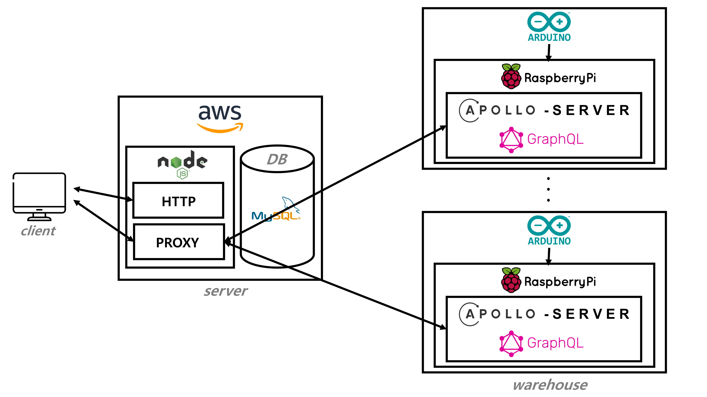

Express framework를 이용하여 이용자가 창고를 등록하고 원하는 면적, 날짜 만큼 대여할 수 있는 공유 플랫폼을 형성하고, 등록한 창고의 경우 창고 상황을 라즈베리파이 및 아두이노 센서로 실시간 모니터링할 수 있는 시스템

# 프로젝트 실행

## 개발 환경

- Windows 10
- VS Code
- Node -v 12.22.4
- npm  -v 6.14.14

## 의존성

### Server

- node.js
- npm

### RaspberryPi

- node.js
- apollo-server-express: 버전 2 이하 (버전 3 이후는 graphql, pubsub 등 별도 설치 필요)

## 로컬 개발 환경 세팅

1. git clone

    ```bash
    $ git clone https://github.com/AUTOINVEN/autoinven.git
    ```

2. `.env` 파일 생성한 폴더에 추가
3. Docker 컨테이너 생성 및 실행

    ```bash
    $ docker-compose build
    $ docker-compose up
    ```

4. 접속

    ```bash
    localhost:5000
    ```

## 아두이노 세팅

1. 아래 회로도 참조하여 구성
2. HW/ArduinoSensor 폴더 안 Arduino_Sensor.ino 파일을 아두이노에 업로드
3. 창고 PC에 연결

## 창고 PC 세팅

- 종프2에서는 라즈베리파이를 사용하였으나, 일반 데스크탑, 노트북 등 무엇을 사용하든 무관.
1. HW/raspi 폴더로 이동
2. 창고 IP 주소 세팅
    - app.js 파일 내 ip 주소 서버 주소로 수정

    ```bash
    ip: '<IP>:<PORT>'
    ```

3. 아두이노 포트 수정
    - 아두이노 연결 후 포트 확인하여 apollo.js 수정
    - 아래 둘 중 하나 수정하면 됨

    ```bash
    var serial = new SerialPort('/COM5', 9600);  // windows
    var serial = new SerialPort('/dev/ttyACM0', 9600);  // raspi
    ```

## 서버 배포

1. `master` 브랜치로 이동 후 `develop` `merge`

    ```bash
    $ git checkout master
    $ git merge develop
    $ git push
    ```

2. AWS EC2 접속
    
    - 해당 정보는 인수 인계 자료 참조
3. 컨테이너 내에 있는 DB 백업
4. autoinven 폴더로 이동

    ```bash
    cd autoinven
    ```

5. `git pull` (`master` 브랜치에서)

    ```bash
    $ git branch  // 브랜치 확인
    $ git pull
    ```

6. Docker 컨테이너 생성

    ```bash
    $ docker-compose build
    $ docker-compose up
    ```

7. 컨테이너 내에 있는 DB 복구

## 아두이노 회로도

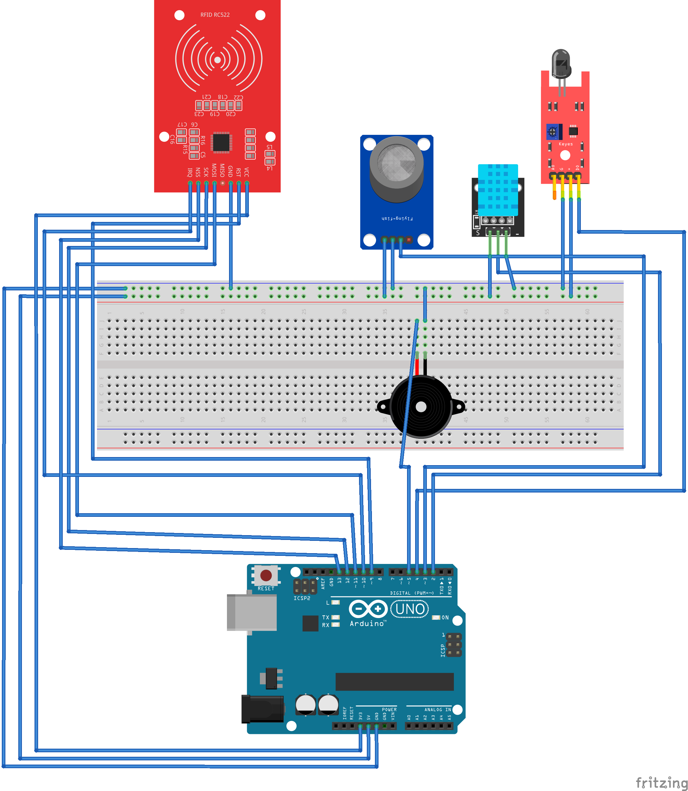

## 브라우저 호환

| [](http://godban.github.io/browsers-support-badges/)<br/>IE / Edge | [](http://godban.github.io/browsers-support-badges/)<br/>Chrome |
| --------- | --------- |
| Edge| last version


# 기능 소개

## 회원 유형

### Provider

- 창고 임대인
- 창고 등록 및 Buyer에게 대여

### Buyer

- 창고 임차인
- Provider에게 요금을 지불 후 대여

### Admin

- 유저 및 창고 관리
- 창고 등록/대여 건에 대하여 승인/거절
- 창고 등록/대여 내역 확인

## 회원가입 및 로그인

### 회원가입

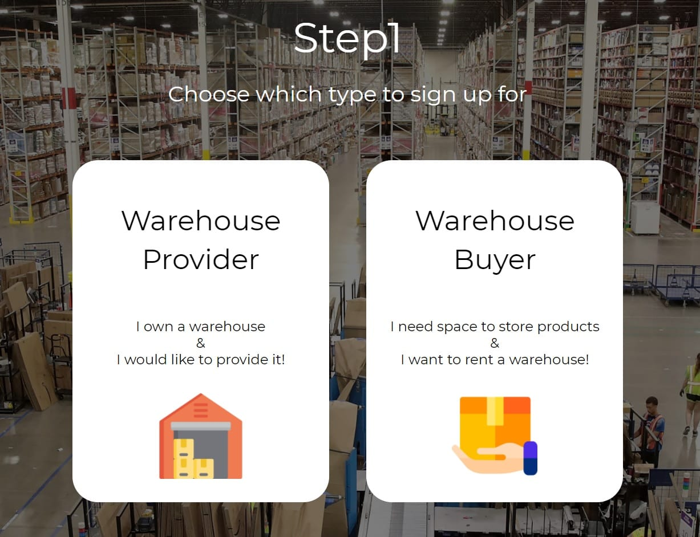

- step 1에서 Provider, Buyer 선택

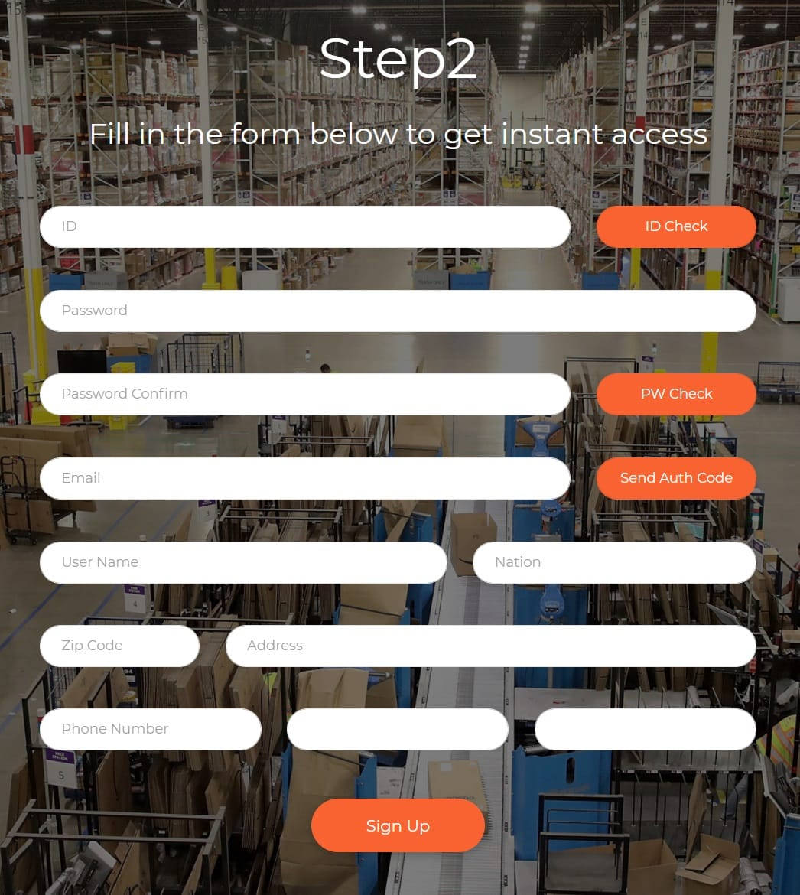

- step 2에서 회원 정보 입력 후 가입 완료
    - 이메일 인증 필요
    - 형식에 맞춰 입력해야 함
    - 한글 입력 불가

### 로그인

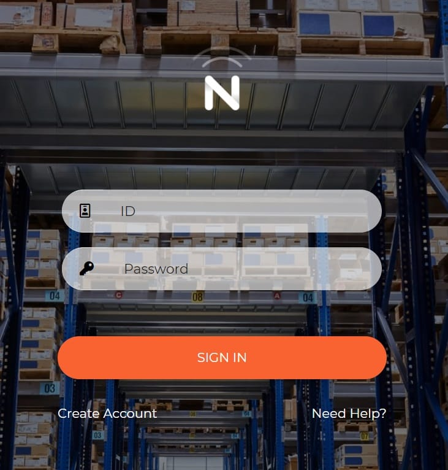

- 아이디, 비밀번호 입력 후 로그인

## 메인화면

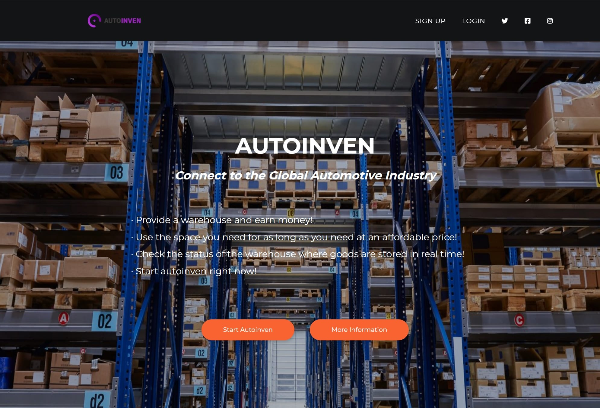

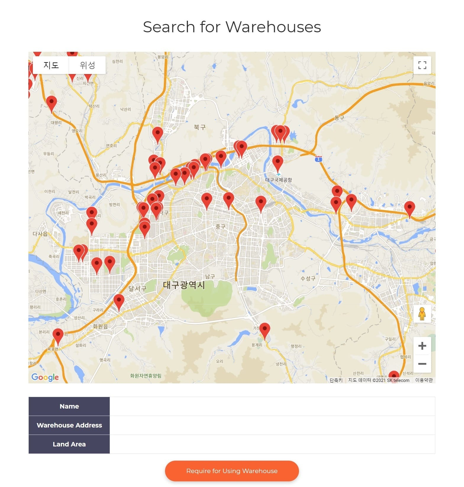

### 공통

- 중앙에 소개 글 표시
- 화면 아래에 지도 및 창고 마커 표시

### 비로그인

- HELP 페이지 버튼, 로그인 화면으로 이동하는 버튼이 존재

### 로그인

- HELP 페이지 버튼만 존재

## 창고 등록

### 등록 신청

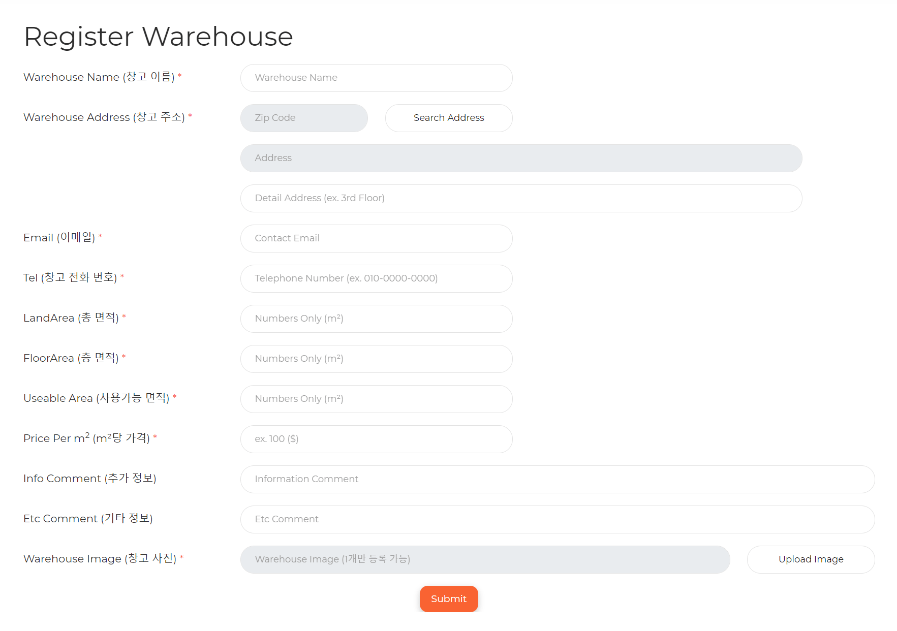

- Register Warehouse → 창고 정보 입력 → Submit
- 한글 입력 불가

### 등록 승인 절차

- Provider 등록 신청 (Register Warehouse) → Admin의 승인/거절
- 승인 시, Provider - My Warehouse, Buyer - Search Warehouse 지도에 표시됨

- 창고 등록 후 Provider 화면

    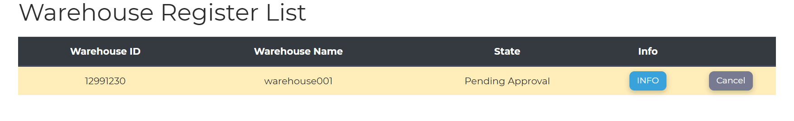

- 창고 등록 후 Admin 화면

    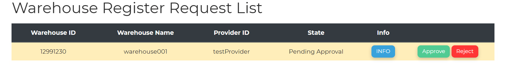

- Admin - 창고 등록 승인 시

    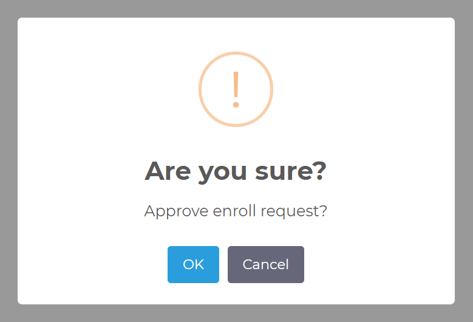

- Admin - 창고 등록 거절 시

    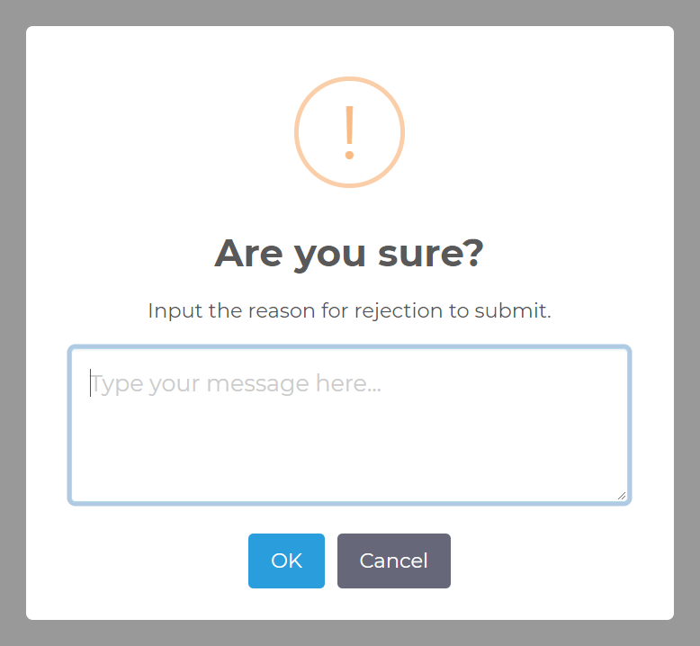

## 창고 대여 신청

### 대여 신청

- Search Warehouse → 지도에서 창고 선택 → Inquire → 면적, 대여 기한 입력 → Submit

    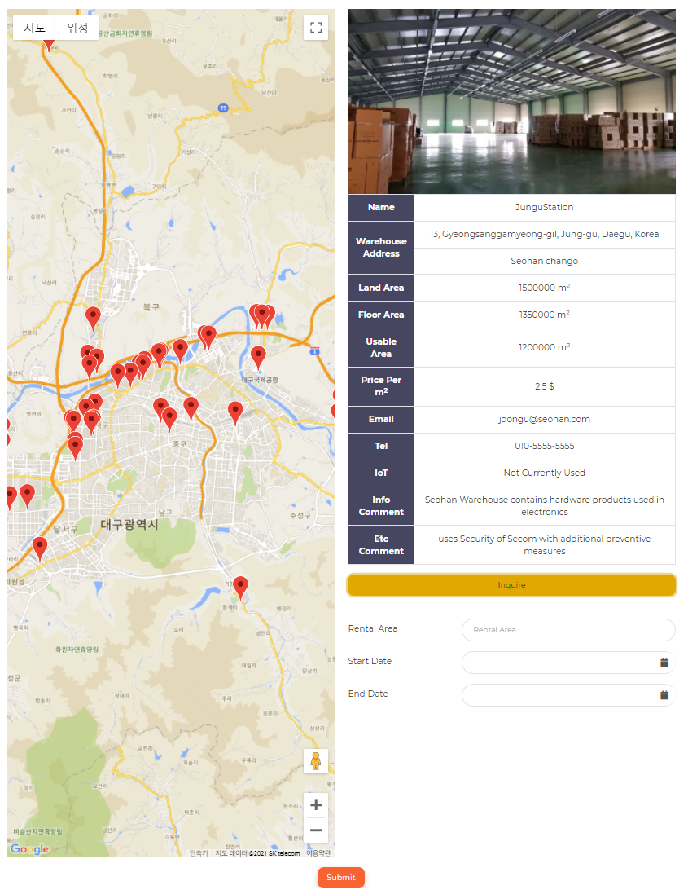

### 대여 승인 절차

- Buyer 대여 신청→ Admin의 승인/거절 → Provider의 승인/거절

    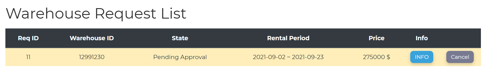

    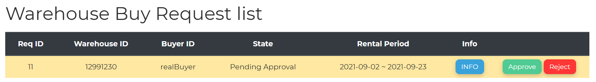

    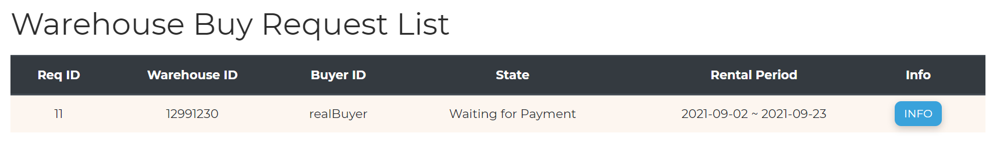

- 승인시 다음 단계로 진행하나, 거절시 거절 사유를 입력하여 이를 상대방에게 알림.
- Buyer는 승인 진행 상황을 Warehouse Request List 에서 확인 가능

### 결제
    
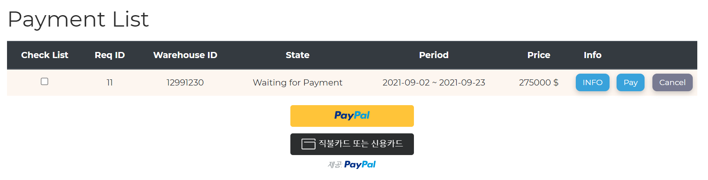

- 결제는 모든 승인 완료 후 Payment List의 내역에 있을 경우 가능

[]()

- Buyer가 결제 후 창고 사용이 시작됨

## 창고 사용

### Buyer

- Usage History에서 현재 사용 중인 창고 사용 / 과거 창고 사용 내역을 확인 가능

    .png)

- Provider의 IoT 서비스 신청 여부에 따라 IoT 서비스 이용 여부 확인 가능
- Provider 및 사용 중인 창고의 세부 정보 확인 가능

    .png)

### Provider

- My Warehouse에서 등록한 창고의 List를 확인 가능

    .png)

- IoT서비스를 신청하여 이용 가능
- 등록한 창고 각각에 대한 세부정보 확인 가능

    .png)

- 창고 이름과 창고 주소를 제외한 창고 정보 수정 가능

    .png)

- 등록한 창고에 대한 Buyer들의 현재 사용 / 과거 구매 내역 확인 가능

    .png)

### Admin

- 승인
    - Provider가 등록한 창고에 대한 정보 확인 후 승인

    .png)

    - Buyer가 창고 사용 신청시(Inquire) 신청 정보 확인 후 승인

    .png)

    - Provider가 신청한 IoT 서비스에 대한 정보 확인 후 승인

    .png)

    - View 페이지를 통해 실제 IoT 서비스 사용 테스트

    .png)

- 내역 확인
    - 전체 창고 목록 확인 가능

    .png)

    - 전체 창고 구매 내역 목록 확인 가능

    .png)

## IoT 서비스

- 창고는 IoT 서비스를 사용중인 창고와 아닌 창고로 나뉨

    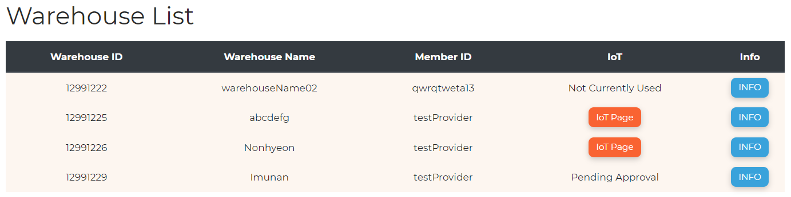

### IoT 서비스 사용 신청

- Provider가 등록한 창고에 대해서 서비스 사용 신청이 가능함.
    1. MY WAREHOUSE → My Warehouse → IoT
    2. Request Service버튼 클릭하면 신청됨

    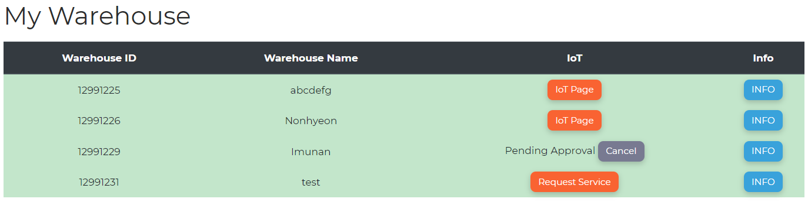

### IoT 서비스 사용 승인

- Admin이 신청을 승인 또는 거절 할 수 있음.
    1. REQUEST → WAREHOUSE IOT → IoT Service Request List

    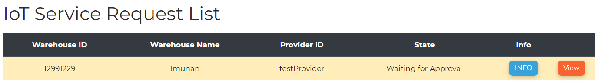

    1. View 버튼 클릭하면 테스트할 수 있는 페이지 나옴.

        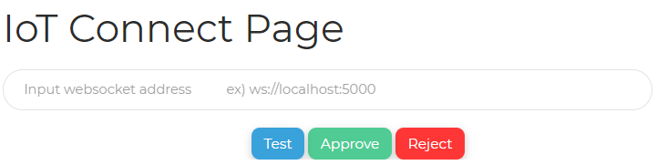

    2. 테스트 후 정상작동하면 승인함
- Provider 및 Buyer는 승인된 창고에 대해서 IoT서비스를 사용할 수 있음.

### 접근 방법

- Buyer: MY WAREHOUSE → USAGE HISTORY → Warehouse Usage → IoT

  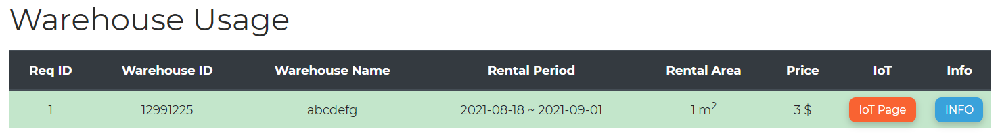

- Provider: MY WAREHOUSE → My Warehouse → IoT 또는 MY WAREHOUSE → My Warehouse → Info → IoT

  

  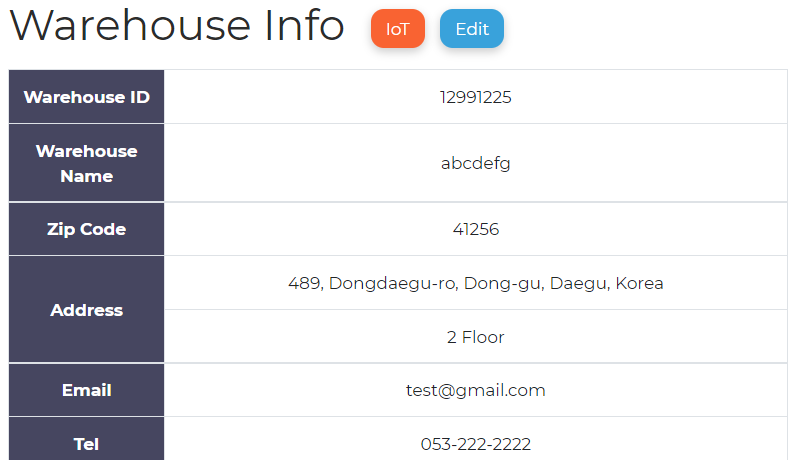

- Admin: List → WAREHOUSE → Warehouse List → IoT

  

  ### Monitoring


  - 창고의 상태를 실시간으로 확인할 수 있음
  - 온도/습도: 현재 온도/습도를 알 수 있음
  - 불꽃/가스: 불꽃/가스 발생 여부를 알 수 있음

  ### Registration


  - 창고의 물품 입출고 상태를 실시간으로 확인할 수 있음

    - Provider는 자신의 창고를 사용하는 모든 사용자의 물품을 볼 수 있음

      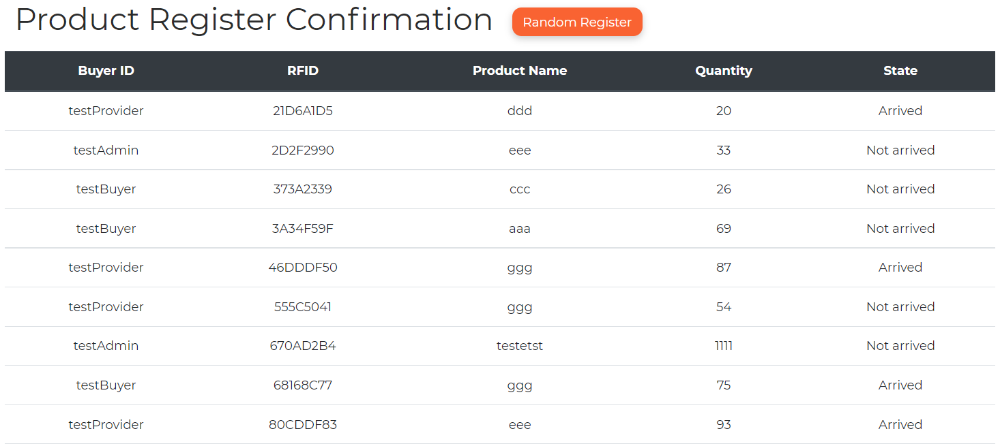

    - Buyer는 자신이 사용하는 창고에 등록한 물품을 볼 수 있음

      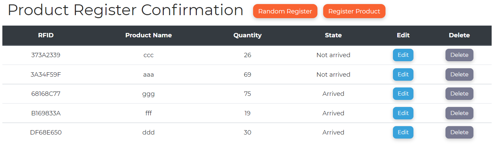

    - Admin은 해당창고의 모든 물품을 볼 수 있음.

      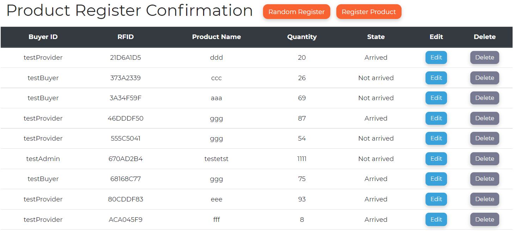

  - 물품을 보내기 전에 물품을 등록하고 자신이 사용하는 창고에 물품을 보냄

    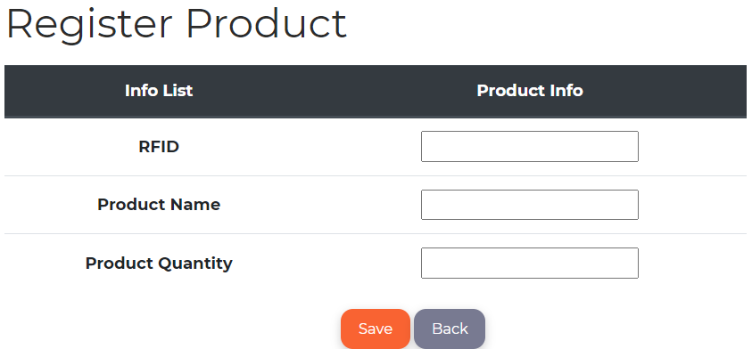

    1. REGISTRATION → Register Product
    2. RFID, 물품 이름, 물품 수량 입력
    3. Save

  - 물품이 창고에 도착하면 RFID태그 인식을 통해 물품 입고를 확인하고 상태가 "Not arrived"에서 "Arrived"로 바뀌는 것을 실시간을 확인할 수 있음

  - Buyer와 Admin에게만 물품 수정 권한이 있음

    1. REGISTRATION → Edit
    2. 이름과 수량 수정(RFID는 수정 불가)
    3. Save

    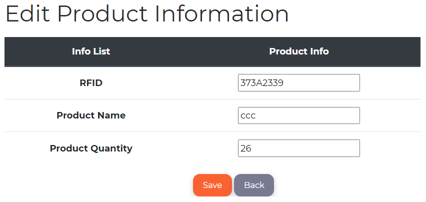

  - Buyer와 Admin에게만 물품 삭제 권한이 있음

    1. REGISTRATION → Delete

## HELP

### HELP

- 로그인 전 - 간단한 서비스 구성도가 보임.

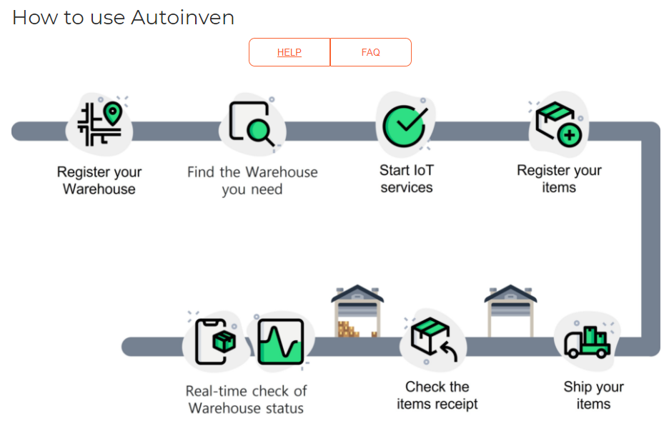

- 로그인 후 - 사용자 계정에 따라 다른 내용이 보임. 관리자는 모든 내용을 볼 수 있음

  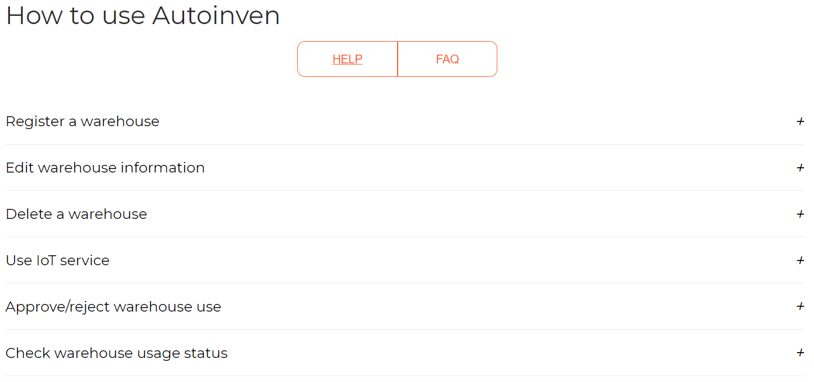

  <provider>

  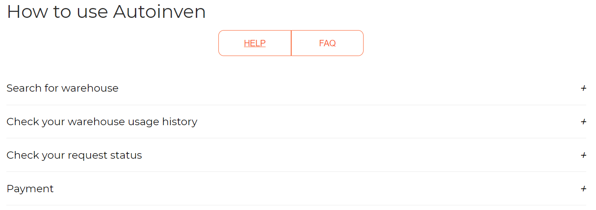

  <buyer>

### FAQ

- 로그인 상태와는 상관없으며 어떤 사용자라도 볼 수 있음.

  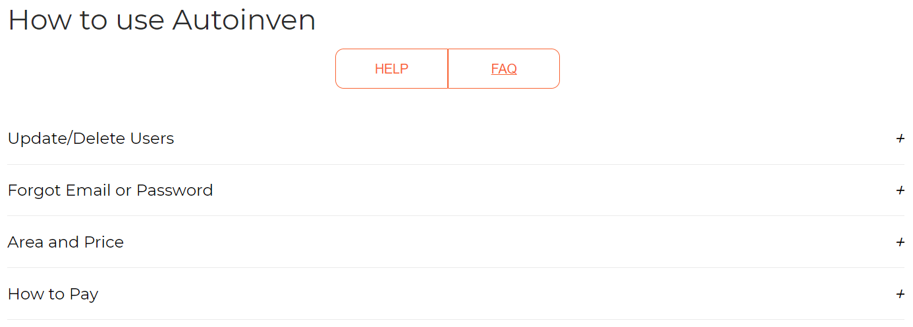

### IoT-Help

- IoT서비스를 사용하는 창고에 대해서 볼 수 있음.

  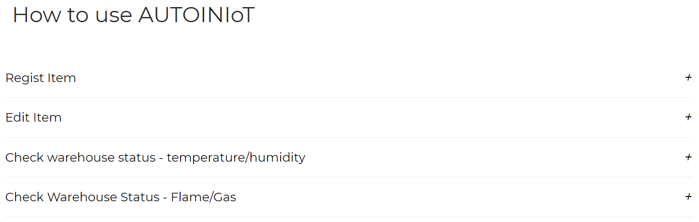

# 참고 링크
- IoT의 이전 버전 Demo Youtube
    - https://youtu.be/wSYU74OY1p0
- IoT 병합 전 버전의 GitHub Repo
    - https://github.com/WOOSIEUN/capstone2021-autoinven
      
# 개선하면 좋은 부분

- 아두이노의 RFID 리더기가 랜덤으로 인식이 되지 않는 케이스가 있음
  - 전원을 껐다 켜면 정상 작동함
  - 메모리 부족으로 추정했으나 아닌 듯하고 정확한 원인을 모르겠음
- 창고 등록시 사진을 여러 개 등록할 수 있도록 할 것
  - 현재 창고 사진 1개 등록할 수 있음
- 클라이언트 - 창고 서버 간의 통신을 프록시로 구현
  - 현재 클라이언트 측에서 창고 서버의 웹소켓 주소를 직접 접속하도록 구현되어 있음
  - 메인 서버가 웹소켓 요청을 받으면 창고 서버로 우회하도록 구현
